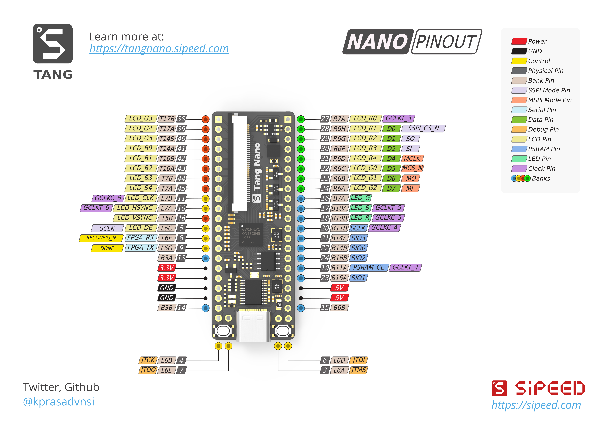

# Play TangNano with Yosys toolchains

## About TangNano

| 芯片     | GW1N-LV1QN48C6/I5 |
| -------- | ----------------- |
| 逻辑资源 | 1152 LUT4         |
| PLL      | 1                 |
| SRAM     | 4 Block, 72Kbit   |
| PSRAM    | 64Mbits           |
| 晶振     | 24MHz             |



## Install YoWASP

```bash
pip install --user yowasp-yosys
pip install --user yowasp-nextpnr-gowin
sudo pacman -S openfpgaloader
```

## Compile

```bash
make
```

## Flash

```bash
make flash
```

## References

1. [YoWASP](https://yowasp.org)

2. [gowin official](http://www.gowinsemi.com.cn/faq.aspx)

3. [TangNano Doc](https://tangnano.sipeed.com/zh/)

4. [Amaranth HDL](https://amaranth-lang.org/docs/amaranth/latest/cover.html)
